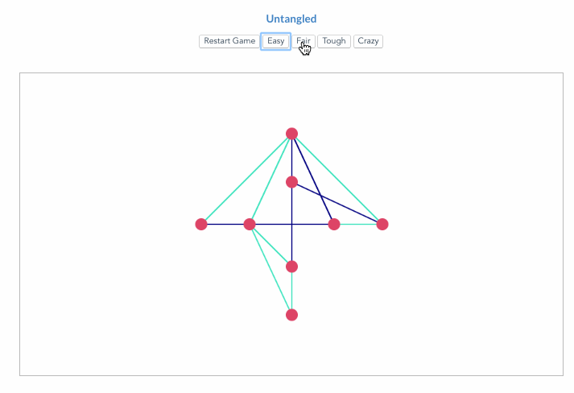

# Untangle game in vue.js

> Untangle game developed in HTML5 Canvas and vue.js based on the work of [stefanonepa/vue-draw-canvas](https://github.com/stefanonepa/vue-draw-canvas)

## [Play Untangled](https://ibrahim.github.io/untangled/)




## Features
- Highligthing line intersections
- Highlighting connected points while dragging
- 4 levels of difficulty

## Credit
- Drag functionality from [stefanonepa/vue-draw-canvas](https://github.com/stefanonepa/vue-draw-canvas)
- Line intersection algorithm from [Makzan Untangle Puzzle HTML5 games](http://makzan.net/html5-games/untangle-wip-dragging/js/untangle.data.js)
- Delaunay Triangulation to build planar graph and ensure a solvable puzzles using [Mikola Lysenko's cdt2d](https://github.com/mikolalysenko/cdt2d)
- Sweepline algorithm to check for line intersection between all points [tokumine/sweepline](https://github.com/tokumine/sweepline)

## TODO
- Currently checking lines intersection is using O(n^2) algorithm.  Optimally the line intersections checking should use sweepline algorithm O(nLogn) using  [tokumine/sweepline](https://github.com/tokumine/sweepline)
- Fixing lines duplication, currently pointA/pointB !== pointB/pointA


## Build Setup

``` bash
# install dependencies
npm install

# serve with hot reload at localhost:8080
npm run dev

# build for production with minification
npm run build

# build for production and view the bundle analyzer report
npm run build --report

# run unit tests
npm run unit

# run all tests
npm test
```

For detailed explanation on how things work, checkout the [guide](http://vuejs-templates.github.io/webpack/) and [docs for vue-loader](http://vuejs.github.io/vue-loader).
